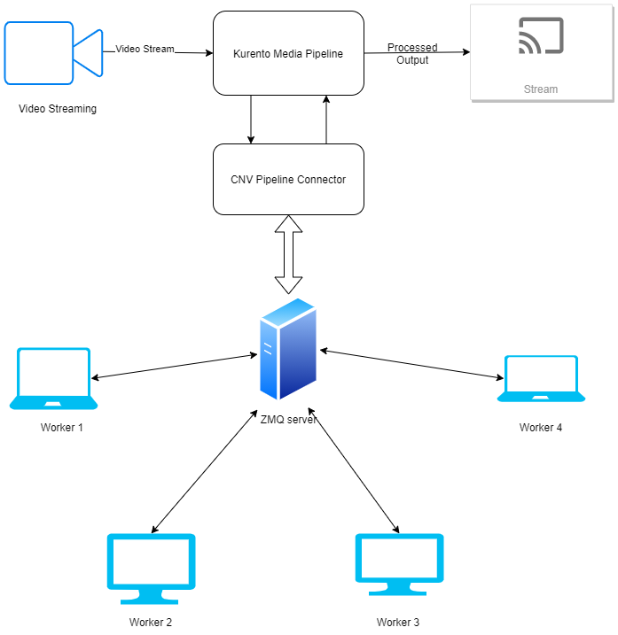

A Part of [Control Net](https://controlnet.ml)

Get docker image from [here](https://hub.docker.com/repository/docker/mayank31313/kurento-additionalmodules).
## Technology Stack
* Kurento Media Server
* Zero MQ

### External Kurento Image Procesing Adaptor

This project uses OpenCV and ZMQ, to process and apply OpenCV Algorithms on kurento media pipeline. I know by doing this it makes kurento media server a bit more tricky, but its easy to apply machine learning algorithms in python than in C/C++, also it makes easier to balance the workload across devices.

### A High Level Overview of the Adapter

